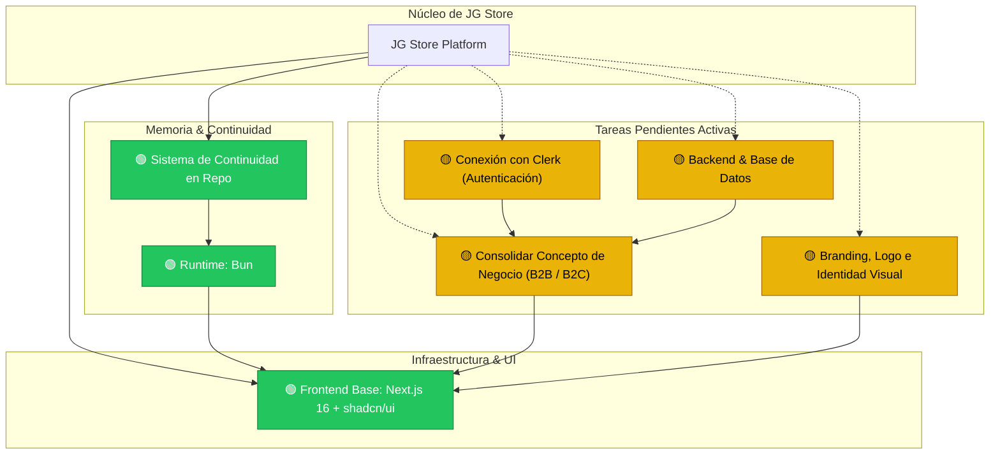

# Grafo de Conocimiento del Proyecto (Knowledge Graph)

> **PROPÓSITO PARA IAS Y DESARROLLADORES:**
> Este documento representa la memoria viva del proyecto **JG Store**. Cualquier IA o desarrollador que trabaje en este repositorio debe leer este archivo antes de realizar tareas para comprender el contexto global, las dependencias y el estado de cada módulo.

---

## 🗺️ Mapa Visual del Proyecto

---

## 🧩 Nodos del Sistema

### 1. 🟢 Base Frontend e Interfaz (`frontend-foundation`)
* **Estado:** Completado.
* **Detalles:** Integración de la plantilla `next-shadcn-dashboard-starter` con Next.js 16 (App Router), Tailwind CSS v4, componentes UI completos de shadcn/ui, tablas TanStack Table, formularios TanStack Form y gráficos Recharts.
* **Ubicación clave:** `src/app/`, `src/components/`, `src/features/`, `src/styles/`.

### 2. 🟢 Runtime y Herramientas (`package-manager`)
* **Estado:** Completado.
* **Detalles:** Uso obligatorio de **`bun`** en todo el ciclo de desarrollo (`bun install`, `bun add`, `bun dev`, `bun run build`).
* **Archivos asociados:** `bun.lock`, `.agents/skills/use-bun/SKILL.md`, `.agents/rules/prefer-bun.md`.

### 3. 🟢 Sistema de Continuidad y Memoria (`continuity-system`)
* **Estado:** Completado.
* **Detalles:** Documentación viva y reproducible en `.agents/knowledge/` y skill especializada en `.agents/skills/project-continuity/` para que el proyecto mantenga su contexto entre diferentes IAs y colaboradores.

### 4. 🟡 Consolidación de Concepto e Idea de Negocio (`business-model`)
* **Estado:** Pendiente.
* **Objetivo:** Definir el catálogo, reglas de venta al mayor (volumen mínimo, descuentos escalonados, aprobación de cuentas B2B) y venta al detal (checkout minorista tradicional).
* **Referencia:** [business-rules.md](./business-rules.md).

### 5. 🟡 Branding, Logo e Identidad Visual (`branding`)
* **Estado:** Pendiente.
* **Objetivo:** Diseñar la identidad de marca, paleta cromática personalizada, logotipo, isotipo y banners de la tienda.

### 6. 🟡 Conexión con Clerk (`auth-clerk`)
* **Estado:** Pendiente.
* **Objetivo:** Conectar las claves API reales de Clerk, configurar URLs de redirección y vincular roles de usuario (administrador, cliente mayorista verificado, cliente minorista).
* **Nota importante:** Se ha dejado intencionalmente como tarea pendiente según directiva del usuario.

### 7. 🟡 Backend y Base de Datos (`backend-database`)
* **Estado:** Pendiente.
* **Objetivo:** Seleccionar y conectar el motor de base de datos (PostgreSQL, Supabase, etc.) para persistencia de productos, inventario y órdenes.
