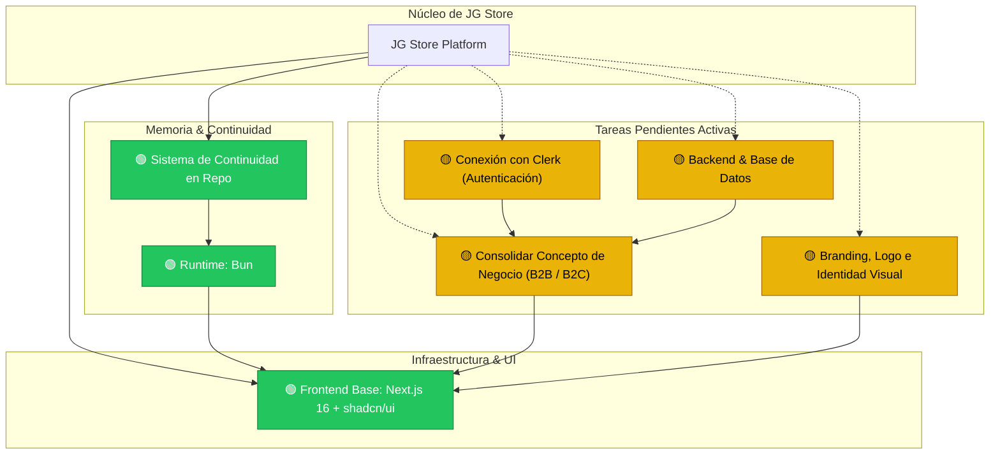

# Grafo de Conocimiento del Proyecto (Knowledge Graph)

> **PROPÓSITO PARA IAS Y DESARROLLADORES:**
> Este documento representa la memoria viva del proyecto **JG Store**. Cualquier IA o desarrollador que trabaje en este repositorio debe leer este archivo antes de realizar tareas para comprender el contexto global, las dependencias y el estado de cada módulo.

---

## 🗺️ Mapa Visual del Proyecto

---

## 🧩 Nodos del Sistema

### 1. 🟢 Base Frontend e Interfaz (`frontend-foundation`)
* **Estado:** Completado.
* **Detalles:** Integración de la plantilla `next-shadcn-dashboard-starter` con Next.js 16 (App Router), Tailwind CSS v4, componentes UI completos de shadcn/ui, tablas TanStack Table, formularios TanStack Form y gráficos Recharts.
* **Ubicación clave:** `src/app/`, `src/components/`, `src/features/`, `src/styles/`.

### 2. 🟢 Runtime y Herramientas (`package-manager`)
* **Estado:** Completado.
* **Detalles:** Uso obligatorio de **`bun`** en todo el ciclo de desarrollo (`bun install`, `bun add`, `bun dev`, `bun run build`).
* **Archivos asociados:** `bun.lock`, `.agents/skills/use-bun/SKILL.md`, `.agents/rules/prefer-bun.md`.

### 3. 🟢 Sistema de Continuidad y Memoria (`continuity-system`)
* **Estado:** Completado.
* **Detalles:** Documentación viva y reproducible en `.agents/knowledge/` y skill especializada en `.agents/skills/project-continuity/` para que el proyecto mantenga su contexto entre diferentes IAs y colaboradores.

### 4. 🟡 Consolidación de Concepto e Idea de Negocio (`business-model`)
* **Estado:** Pendiente.
* **Objetivo:** Definir el catálogo, reglas de venta al mayor (volumen mínimo, descuentos escalonados, aprobación de cuentas B2B) y venta al detal (checkout minorista tradicional).
* **Referencia:** [business-rules.md](./business-rules.md).

### 5. 🟢 Branding, Logo e Identidad Visual Oficial (`branding`)
* **Estado:** Completado.
* **Detalles:** 
  - Paleta cromática oficial implementada: `#E63946` (Rojo Pasión / Principal), `#FF85A2` (Rosa Cálido / Acento), `#D4A017` (Dorado Calidad / Mayorista VIP), `#F8F8F7` / `#FFFFFF` (Superficie y Fondo Diurno), `#6C757D` (Gris Pizarra / Neutros).
  - Tipografías oficiales configuradas: **Bebas Neue Cyrillic** para Display/Títulos y **Gotham** para UI/Cuerpo/Botones.
  - Tema oficial `jg-store` registrado en `src/styles/themes/jg-store.css` y `theme.config.ts`.
  - Isotipo y Favicon oficial multiformato (`src/app/icon.png`, `public/brand/logo-icon.png`).
  - Logo oficial institucional JG-STORE POLIRUBRO con versión diurna y nocturna adaptativa en `src/components/brand/logo.tsx`.
  - Botón selector interactivo de **Modo Diurno (fondo blanco puro #FFFFFF)** y **Modo Nocturno (#111215)** integrado en el header del storefront.
  - Skill de diseño [`.agents/skills/brand-design-system/SKILL.md`](../skills/brand-design-system/SKILL.md).

### 6. 🟢 Storefront & Experiencia de Compra Dual B2B/B2C (`storefront`)
* **Estado:** Completado.
* **Detalles:**
  - 24 departamentos oficiales, Hero Banner con propuesta de valor, filtro interactivo de favoritos.
  - Carrito deslizable con cálculo dinámico de ahorro mayorista y checkout por WhatsApp estructurado.
  - Sistema de favoritos (Wishlist) con Zustand y persistencia LocalStorage + migración SQL para tablas `users` y `favorites`.
  - **Página de Producto Grande estilo Mercado Libre (`/producto/[id]`):** Tira de miniaturas verticales, zoom de fotografía principal, condición y calificaciones, bloque de precios dual Detal/Mayor con % de descuento, caja de compra ("Buy Box") con botón de WhatsApp directo y botón de carrito, ficha técnica de especificaciones y sección de recomendados *"Quienes vieron este producto también compraron"*.

### 7. 🟡 Conexión con Clerk (`auth-clerk`)
* **Estado:** Pendiente.
* **Objetivo:** Conectar las claves API reales de Clerk, configurar URLs de redirección y vincular roles de usuario (administrador, cliente mayorista verificado, cliente minorista).
* **Nota importante:** Se ha dejado intencionalmente como tarea pendiente según directiva del usuario.

### 8. 🟡 Backend y Base de Datos (`backend-database`)
* **Estado:** Pendiente de migración remota.
* **Objetivo:** Conexión con PostgreSQL / Supabase Dokploy (`http://jg-store-bd.press-cloud.com`) ejecutando los scripts SQL preparados (`20260917_create_products_table.sql` y `20260925_create_users_and_favorites_tables.sql`).

