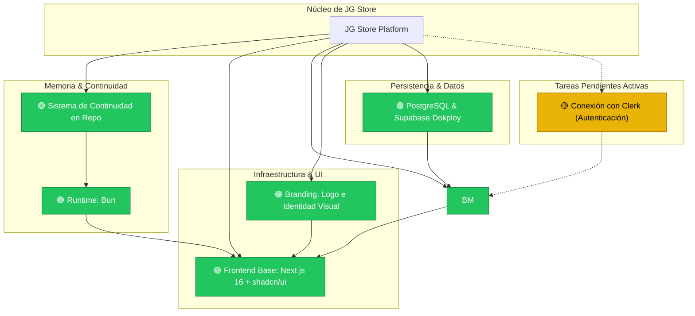

# Grafo de Conocimiento del Proyecto (Knowledge Graph)

> **PROPÓSITO PARA IAS Y DESARROLLADORES:**
> Este documento representa la memoria viva del proyecto **JG Store**. Cualquier IA o desarrollador que trabaje en este repositorio debe leer este archivo antes de realizar tareas para comprender el contexto global, las dependencias y el estado de cada módulo.

---

## 🗺️ Mapa Visual del Proyecto

---

## 🧩 Nodos del Sistema

### 1. 🟢 Base Frontend e Interfaz (`frontend-foundation`)
* **Estado:** Completado.
* **Detalles:** Integración de la plantilla `next-shadcn-dashboard-starter` con Next.js 16 (App Router), Tailwind CSS v4, componentes UI completos de shadcn/ui, tablas TanStack Table, formularios TanStack Form y gráficos Recharts.
* **Ubicación clave:** `src/app/`, `src/components/`, `src/features/`, `src/styles/`.

### 2. 🟢 Runtime y Herramientas (`package-manager`)
* **Estado:** Completado.
* **Detalles:** Uso obligatorio de **`bun`** en todo el ciclo de desarrollo (`bun install`, `bun add`, `bun dev`, `bun run build`).
* **Archivos asociados:** `bun.lock`, `.agents/skills/use-bun/SKILL.md`, `.agents/rules/prefer-bun.md`.

### 3. 🟢 Sistema de Continuidad y Memoria (`continuity-system`)
* **Estado:** Completado.
* **Detalles:** Documentación viva y reproducible en `.agents/knowledge/` y skill especializada en `.agents/skills/project-continuity/` para que el proyecto mantenga su contexto entre diferentes IAs y colaboradores.

### 4. 🟢 Consolidación de Concepto de Negocio Argentino B2B/B2C (`business-model`)
* **Estado:** Completado.
* **Detalles:**
  - Localización total para el mercado de la República Argentina (Polirrubro B2B / B2C).
  - Precios de catálogo reales en Pesos Argentinos (`$` ARS) con formateo `es-AR`.
  - **Barra de Progreso Mayorista ($ 50.000 ARS):** Desbloqueo automático de precios mayoristas en toda la orden al alcanzar el umbral de $ 50.000 ARS, o por cantidad unitaria de producto.
  - Reglas de facturación comercial AFIP/ARCA: Factura A (Responsable Inscripto con CUIT) y Factura B (Consumidor Final / Monotributo).
  - Medios de pago nacionales: Mercado Pago y Transferencia Bancaria CBU/CVU/Alias con 10% de descuento.
  - Envíos a todo el país: Andreani, Correo Argentino y Expresos de Carga al interior con despacho en CABA/GBA.
* **Referencia:** [business-rules.md](./business-rules.md).

### 5. 🟢 Branding, Logo e Identidad Visual Oficial (`branding`)
* **Estado:** Completado.
* **Detalles:** 
  - Paleta cromática oficial implementada: `#E63946` (Rojo Pasión / Principal), `#FF85A2` (Rosa Cálido / Acento), `#D4A017` (Dorado Calidad / Mayorista VIP), `#F8F8F7` / `#FFFFFF` (Superficie y Fondo Diurno), `#6C757D` (Gris Pizarra / Neutros).
  - Tipografías oficiales configuradas: **Bebas Neue Cyrillic** para Display/Títulos y **Gotham** para UI/Cuerpo/Botones.
  - Tema oficial `jg-store` registrado en `src/styles/themes/jg-store.css` y `theme.config.ts`.
  - Isotipo y Favicon oficial multiformato (`src/app/icon.png`, `public/brand/logo-icon.png`).
  - Logo oficial institucional JG-STORE POLIRUBRO con versión diurna y nocturna adaptativa en `src/components/brand/logo.tsx`.
  - Botón selector interactivo de **Modo Diurno (fondo blanco puro #FFFFFF)** y **Modo Nocturno (#111215)** integrado en el header del storefront.
  - Skill de diseño [`.agents/skills/brand-design-system/SKILL.md`](../skills/brand-design-system/SKILL.md).

### 6. 🟢 Storefront & Experiencia de Compra Dual B2B/B2C (`storefront`)
* **Estado:** Completado.
* **Detalles:**
  - 24 departamentos oficiales, Hero Banner con propuesta de valor, filtro interactivo de favoritos.
  - Carrito deslizable de gran formato (hasta 5XL) con distribución de 2 columnas en desktop, cálculo dinámico de ahorro mayorista, validación explicativa con banner de campos faltantes y checkout por WhatsApp estructurado.
  - **Buscador con disparador en Enter y Barra Lateral Estilo Mercado Libre (`SearchSidebarFilter`):**
    - La búsqueda no se ejecuta automáticamente al teclear sino que espera a que el usuario presione **Enter** o haga clic en el botón de búsqueda.
    - Al buscar o al **pulsar cualquiera de las 24 categorías oficiales**, el catálogo se reestructura automáticamente en 2 columnas estilo Mercado Libre, ocultando carruseles y banners para enfocar los productos:
      - **Columna Izquierda:** Título del rubro/término y total de resultados, chips de filtros activos con botón `x`, botón para volver a todos los departamentos, subcategorías del rubro con conteo de productos, accesos a otros departamentos, conmutadores interactivos (*En stock inmediato*, *Tarifa Mayorista B2B*, *Tienda Oficial JG*), desglose de **Marcas** con conteo de ítems, selector de **Rango de Precio** (rangos predefinidos + inputs mínimo y máximo con botón `>`), información de **Condición** (*Nuevo en caja*) y **Envíos y Despacho**.
      - **Columna Derecha:** Encabezado con migas de pan (`Inicio > Departamento > Subcategoría`), título dinámico con badge de cantidad, selector de ordenamiento y cuadrícula responsiva de tarjetas de productos.
      - **Soporte Móvil:** Botón superior *"Filtros (N)"* con drawer deslizable responsivo.
  - Sistema de favoritos (Wishlist) con Zustand y persistencia LocalStorage + migración SQL para tablas `users` y `favorites`.
  - **Página de Producto Grande estilo Mercado Libre (`/producto/[id]`):** Tira de miniaturas verticales, zoom de fotografía principal, condición y calificaciones, bloque de precios dual Detal/Mayor con % de descuento, caja de compra ("Buy Box") con botón de WhatsApp directo y botón de carrito, ficha técnica de especificaciones y sección de recomendados *"Quienes vieron este producto también compraron"*.

### 7. 🟡 Conexión con Clerk (`auth-clerk`)
* **Estado:** Pendiente.
* **Objetivo:** Conectar las claves API reales de Clerk, configurar URLs de redirección y vincular roles de usuario (administrador, cliente mayorista verificado, cliente minorista).
* **Nota importante:** Se ha dejado intencionalmente como tarea pendiente según directiva del usuario.

### 8. 🟢 Backend y Base de Datos Remota Dokploy Supabase (`backend-database`)
* **Estado:** Completado.
* **Detalles:**
  - Migración y aprovisionamiento exitoso en la instancia PostgreSQL 17.6 / Supabase Dokploy en `http://jg-store-bd.press-cloud.com` vía el endpoint de superusuario `/pg/query`.
  - Tablas instanciadas con RLS e índices B-Tree: `categories`, `subcategories`, `sub_subcategories`, `products`, `product_variants`, `users`, `favorites`, `orders`, `order_items`.
  - Vistas desnormalizadas operativas: `vw_product_hierarchy`, `vw_products_with_hierarchy`, `vw_favoritos_detalle`.
  - Seed taxonómico integral: 24 departamentos oficiales, 54 subcategorías comerciales y 90 líneas de producto específicas.
  - Catálogo inicial de 28 productos poblado con precios duales B2B/B2C en `$ ARS` y mapeo jerárquico.
  - 12 endpoints PostgREST probados y respondiendo HTTP 200 OK (`/rest/v1/*`).

### 9. 🟢 Panel de Gestión de Pedidos y Cotizaciones (`orders-management`)
* **Estado:** Completado.
* **Detalles:**
  - Panel administrativo completo en `/dashboard/orders` integrado en la barra de navegación lateral.
  - Soporte B2B y B2C en Argentina: discriminación de Factura A (CUIT) vs Factura B (DNI), medios de pago (Mercado Pago / Transferencia CBU con 10% OFF), logística a todo el país (Andreani / Correo Argentino / Expresos al interior / Retiro en depósito).
  - 4 métricas ejecutivas en `$ ARS`: Facturación total, Pedidos Mayoristas B2B, Pedidos Minoristas B2C, y Pendientes de preparación.
  - Cajón lateral interactivo `OrderDetailSheet` con desglose de ítems, cálculo de ahorro mayorista, editor de número de guía/remito y botón de contacto por WhatsApp.
  - Tabla TanStack Table con búsqueda y filtros sincronizados en URL con `nuqs`.
  - Migración SQL en `supabase/migrations/20260926_create_orders_tables.sql`.

### 10. 🟢 Limpieza de Navegación y Menús Extra (`dashboard-cleanup`)
* **Estado:** Completado.
* **Detalles:** Ocultados de `src/config/nav-config.ts` los menús demo marcados por el usuario (Workspaces, Teams, Kanban, Chat, AI Chat, sección Elements completa y Pro), dejando la barra lateral depurada y exclusiva para JG Store.

### 11. 🟢 Módulo de Configuración de la Tienda (`store-config`)
* **Estado:** Completado.
* **Detalles:** Grupo de configuración en el panel administrativo (`/dashboard/config`) con 3 submódulos interactivos y sincronización en tiempo real con el Storefront:
  1. **Información General (`/dashboard/config/general`):** Configuración del número oficial de WhatsApp (actualiza dinámicamente todos los enlaces y botones de compra del carrito, fichas y favoritos), descripción del pie de página, horarios, dirección de depósito, CUIT, email y redes sociales.
  2. **Diseño de Landing (`/dashboard/config/landing`):** Vitrina de categorías estilo SHOPLUXE con fotos miniatura circulares de productos reales (permanece visible al seleccionar categoría), gestor de carruseles de productos de costado con flechas de navegación, y **sección de visibilidad de bloques & filtros opcionales** (switches interactivos para alternar los 4 pilares de confianza del Hero Banner, la barra de categorías en texto, el filtro de Tienda Oficial JG en búsqueda y el cintillo de avisos).
  3. **Temas y Apariencia (`/dashboard/config/theme`):** Selector interactivo con vista previa de colores para las 11 paletas del sistema y selector de modo diurno (blanco) / nocturno (oscuro) / sistema.

### 12. 🟢 Jerarquía de Productos en 3 Niveles en Base de Datos y Catálogo (`hierarchical-products`)
* **Estado:** Completado.
* **Detalles:**
  - **Estructura Relacional SQL (`supabase/migrations/20261001_hierarchical_product_categories_3_levels.sql`):** Tablas `categories` (Nivel 1 - 24 departamentos oficiales), `subcategories` (Nivel 2 - subcategorías comerciales) y `sub_subcategories` (Nivel 3 - líneas específicas de producto), vinculadas a `products` con columnas opcionales, claves foráneas, índices de búsqueda y vistas desnormalizadas `vw_product_hierarchy` y `vw_products_with_hierarchy`.
  - **Dominio TypeScript (`src/types/store.ts` y `src/constants/categories.ts`):** Interfaces `SubCategory` y `SubSubCategory`, catálogo completo de las 24 categorías anidadas en 3 niveles y funciones de ayuda (`getSubcategoriesByCategory`, `getSubSubcategories`, `formatCategoryBreadcrumb`).
  - **Formulario Administrativo de Productos (`src/features/products/components/product-form.tsx`):** Selectores en cascada Nivel 1 ➔ Nivel 2 ➔ Nivel 3 con `useStore` reactivo de TanStack Form, auto-reseteo de niveles descendientes y badge de previsualización de ruta.
  - **Indexación y Búsqueda (`src/lib/search-engine.ts` y `src/lib/store-service.ts`):** Coincidencia de tokens, typos fuzzy y puntuación de sinónimos polirrubro sobre nombres y slugs de subcategorías y sub-subcategorías, además de soporte para filtrado directo.
  - **Ficha de Producto Storefront (`src/components/storefront/product-detail-view.tsx`):** Migas de pan de 3 niveles completas (`Inicio > Categoría > Subcategoría > Línea > Producto`).

### 13. 🟢 Testing Integral & Aseguramiento de Calidad E2E (`system-testing`)
* **Estado:** Completado.
* **Detalles:**
  - Suite de 33 pruebas automatizadas ejecutadas con `bun test` (0 fallos, 552 aserciones):
    - `src/tests/categories-hierarchy.test.ts`: Integridad de 24 departamentos, subcategorías Nivel 2, líneas Nivel 3 y helpers de breadcrumbs.
    - `src/tests/search-engine.test.ts`: Búsqueda exacta, typos fuzzy (Levenshtein), sinónimos polirrubro y coincidencia de 3 niveles.
    - `src/tests/whatsapp-orders.test.ts`: Formato `$ ARS`, precios detal/mayorista, umbral global $ 50.000 ARS, Factura A/B y sanitización de emojis sin `\uFE0F`.
    - `src/tests/store-service.test.ts`: Consultas con filtros de categoría, ordenamiento, stock y ciclo de vida CRUD.
    - `src/tests/e2e-http-routes.test.ts`: Validación de respuesta HTTP 200 en storefront, detalle de producto, dashboard y configuración.
  - Script `"test": "bun test"` registrado en `package.json` para ejecución instantánea.

### 14. 🟡 Interfaz de Configuración de Cuenta de Cliente No Administrador (`customer-account-settings`)
* **Estado:** Pendiente prioritaria solicitada por el usuario.
* **Objetivo:** Portal y vista de cuenta de usuario no administrativo (`/cuenta` o `/perfil-cliente`), independiente del panel de control de administración (`/dashboard`).
* **Módulos incluidos:**
  - **Datos Personales y Fiscales:** Edición de Nombre, Razón Social, CUIT/DNI, Teléfono/WhatsApp y tipo de factura por defecto (A o B).
  - **Libreta de Direcciones:** Guardado de domicilios de entrega (localidad, código postal, calle, expreso habitual) con auto-completado en el checkout.
  - **Historial de Pedidos:** Registro y seguimiento de cotizaciones y pedidos enviados por WhatsApp con remitos y estados.
  - **Seguridad y Nivel de Cuenta:** Gestión de contraseña y condición comercial (Cliente Detal B2C / Mayorista B2B VIP Verificado).

### 15. 🟢 Módulo Scraper Coronel Mayorista & Terminal en Vivo (`coronel-scraper`)
* **Estado:** Completado (Paso 1 Local + Cloud Dokploy noVNC).
* **Detalles:**
  - Código base clonado y adaptado en `scraping-coronel/` con entorno virtual Python y Selenium para navegación interactiva con Google Chrome.
  - Sustitución de Tkinter por señal en archivo `.scraper_continue` emitible desde el panel web.
  - Capturas periódicas en `preview.png` y transmisión continua para visualización del navegador.
  - **Despliegue Cloud en Dokploy (`uJJ_UD7QnPV9FrDO5fsKR`):** Microservicio Docker independiente en el proyecto `JG-STORE` corriendo Python 3.11, Google Chrome (`--no-sandbox`), `Xvfb` (pantalla virtual :99), `x11vnc`, `noVNC` y `FastAPI`, unificado bajo Nginx en el puerto 80 en el dominio `coronel.press-cloud.com`.
  - **Visor Interactivo Remoto (Opción A):** Integrado en el panel `/dashboard/coronel` mediante `<iframe>` noVNC, permitiendo que el usuario mueva el ratón y haga clics sobre la página de Coronel Mayorista directamente desde la web, confirme la categoría, presione "CONTINUAR SCRAPING" y apague su PC mientras el proceso continúa en el servidor.
  - Paso 2 (Sincronización remota a Tiendanube) pausado deliberadamente por indicación comercial del usuario.

