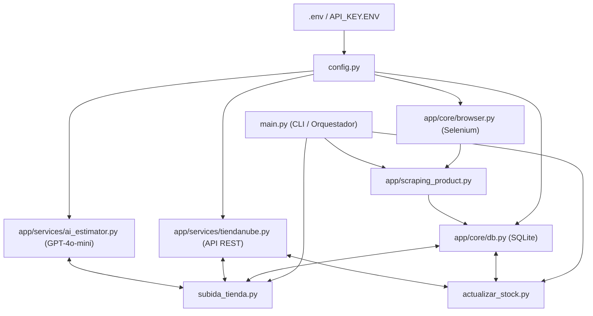

# 🤖 AGENTS.md — Guía Maestra para Agentes de IA

Bienvenido a **Scraping-Coronel (JG-STORE)**. Este documento es el manual operativo y mapa cognitivo para agentes de Inteligencia Artificial (Antigravity, Claude, ChatGPT, Cursor, etc.). Está diseñado para maximizar la velocidad de comprensión del repositorio y **minimizar el consumo de tokens de contexto**.

---

## ⚡ Guía Rápida de Ahorro de Tokens
1. **NO leas todos los archivos `.py` para entender la arquitectura.**
   - Consulta directamente el **Grafo de Conocimiento**: [docs/KNOWLEDGE_GRAPH.md](file:///d:/Repositorios/Scraping-Coronel/docs/KNOWLEDGE_GRAPH.md) y [docs/code_graph.json](file:///d:/Repositorios/Scraping-Coronel/docs/code_graph.json).
   - Ahí tienes todas las funciones, clases, firmas, llamadas entre módulos, tablas SQLite y APIs externas mapeadas en AST.
2. Si agregas o renombras funciones o archivos, actualiza el grafo con:
   ```bash
   python tools/generate_code_graph.py
   ```

---

## 🧭 Propósito y Flujo del Sistema

El sistema automatiza el catálogo de e-commerce de **JG-STORE**:
1. **Extracción (Scraping)**: Autentica en [Coronel Mayorista](https://www.coronelmayorista.com) vía Selenium, descarga la lista de precios en Excel e itera el catálogo web extrayendo SKUs, fotos, descripciones y precios mayoristas.
2. **Persistencia Local**: Normaliza los datos en SQLite ([productos.db](file:///d:/Repositorios/Scraping-Coronel/productos.db)).
3. **Enriquecimiento con IA**: Estima dimensiones de empaque (`peso_kg`, `ancho_cm`, `alto_cm`, `profundidad_cm`) usando OpenAI GPT-4o-mini con fallback seguro si no hay API key o saldo.
4. **Sincronización Tiendanube**: Conecta con la API REST de Tiendanube, calcula el PVP aplicando margen de ganancia (%) y crea/actualiza productos, variantes e imágenes.
5. **Control de Stock y Discontinuados**: Inactiva o pone stock `0` a productos agotados o eliminados del catálogo del mayorista.

---

## 🏗️ Capas de la Arquitectura



- **`app/core/`**: Infraestructura base.
  - [browser.py](file:///d:/Repositorios/Scraping-Coronel/app/core/browser.py): Factory de Chrome WebDriver.
  - [db.py](file:///d:/Repositorios/Scraping-Coronel/app/core/db.py): Controlador de SQLite con context manager y consultas SQL.
- **`app/services/`**: Servicios de terceros y lógica de negocio.
  - [tiendanube.py](file:///d:/Repositorios/Scraping-Coronel/app/services/tiendanube.py): Cliente REST con control de *rate limiting* y caché en disco (`app/api_cache/`).
  - [ai_estimator.py](file:///d:/Repositorios/Scraping-Coronel/app/services/ai_estimator.py): Estimación de medidas de empaque por lotes, control de consumo y saldo (`openai_saldo.json`).
- **Raíz (CLI & Pipelines)**:
  - [main.py](file:///d:/Repositorios/Scraping-Coronel/main.py): Orquestador con subcomandos `scrape`, `sync`, `stock`, `full-run`, `scrape-sync`.
  - [config.py](file:///d:/Repositorios/Scraping-Coronel/config.py): Carga centralizada de credenciales.
  - [Sincronizar_JG_Store.bat](file:///d:/Repositorios/Scraping-Coronel/Sincronizar_JG_Store.bat): Lanzador Windows amigable para usuarios no técnicos.

---

## 🗄️ Esquema de Datos (SQLite `productos.db`)

Tabla principal: `productos`
```sql
CREATE TABLE IF NOT EXISTS productos (
    codigo TEXT PRIMARY KEY,       -- SKU base del producto (ej: COR-12345)
    codigo_barra TEXT,             -- Código de barras cruzado desde el Excel
    descripcion TEXT,              -- Nombre y detalle del producto
    precio TEXT,                   -- Precio base mayorista
    imagen_url TEXT,               -- URL remota de la imagen en Coronel
    imagen_local TEXT,             -- Ruta local si se descargó en img-scraping
    variante TEXT,                 -- Nombre o identificador de variante (si aplica)
    categoria TEXT,                -- Categoría padre
    subcategoria TEXT,             -- Subcategoría hija
    peso_kg TEXT,                  -- Peso estimado para envíos
    ancho_cm TEXT,                 -- Ancho del paquete
    alto_cm TEXT,                  -- Alto del paquete
    profundidad_cm TEXT            -- Profundidad del paquete
);
```

---

## 🛠️ Comandos Operativos

Siempre ejecutar con codificación UTF-8 en Windows para evitar fallos de consola por caracteres especiales:

```bash
# Pipeline interactivo o menú general
python -X utf8 main.py

# Subcomando: solo scraping
python -X utf8 main.py scrape -g 40 -d t -y

# Subcomando: solo sincronización a Tiendanube
python -X utf8 main.py sync -g 40

# Subcomando: solo actualización de stock
python -X utf8 main.py stock

# Pipeline completo (Scrape -> Sync -> Stock)
python -X utf8 main.py full-run -g 40 -d t -y

# Regenerar Grafo de Conocimiento tras cambios de código
python tools/generate_code_graph.py

# Diagnóstico de variables de entorno y OpenAI
python test_env.py
```

---

## 🔐 Variables de Entorno Requeridas

Archivos soportados: `API_KEY.ENV`, `.env`, `api_key.env`.
```env
CORONEL_CUIT=...
CORONEL_PASSWORD=...
TIENDANUBE_STORE_ID=...
TIENDANUBE_ACCESS_TOKEN=...
TIENDANUBE_USER_AGENT=...
OPENAI_API_KEY=...       # Opcional (fallback a medidas predeterminadas si falta)
```

---

## 📜 Reglas de Oro para Agentes al Modificar Código

1. **Preservar Codificación en Windows**: En cualquier script ejecutable o CLI, asegurar `sys.stdout.reconfigure(encoding='utf-8', errors='replace')` al inicio.
2. **Respetar Rate Limits de Tiendanube**: Nunca remover los sleeps y cabeceras de reintento del cliente en `tiendanube.py`.
3. **Fallback Resiliente de IA**: Cualquier integración de OpenAI debe funcionar incluso si no hay clave API o no hay saldo.
4. **Preservar Docstrings y Comentarios Existentes**: No eliminar comentarios explicativos existentes.
5. **No commitear credenciales**: Nunca incluir llaves reales de Tiendanube ni OpenAI en archivos públicos ni en commits de Git.
