# 🌐 Grafo de Conocimiento del Código (Knowledge Graph)

> Este documento describe la estructura modular, relaciones, llamadas y puntos de entrada
> del repositorio para que cualquier agente de IA o desarrollador pueda navegarlo con mínimo consumo de tokens.

## 📊 Resumen General
- **Módulos Python analizados:** 24
- **Relaciones internas detectadas:** 46

## 🗺️ Mapa de Relaciones (Mermaid Graph)

```mermaid
graph TD
    subgraph Core [Capa Core]
        app_core_browser_py["app/core/browser.py"]
        app_core_db_py["app/core/db.py"]
        app_core_logger_py["app/core/logger.py"]
        app_core_models_py["app/core/models.py"]
    end
    subgraph Services [Capa Servicios]
        app_services_ai_estimator_py["app/services/ai_estimator.py"]
        app_services_tiendanube_py["app/services/tiendanube.py"]
    end
    subgraph Scripts [Scripts & CLI]
        actualizar_stock_py["actualizar_stock.py"]
        api_tiendanube_py["api_tiendanube.py"]
        config_py["config.py"]
        connect_api_py["connect_api.py"]
        contigencia_borrar_Categorias_py["contigencia_borrar_Categorias.py"]
        contingencia_borrar_subcategorias_py["contingencia_borrar_subcategorias.py"]
        curl_api_py["curl-api.py"]
        main_py["main.py"]
        n_categorias_py["n_categorias.py"]
        scraping_coronel_py["scraping_coronel.py"]
        subida_tienda_py["subida_tienda.py"]
        test_env_py["test_env.py"]
        app_guardar_excel_py["app/guardar_excel.py"]
        app_limpiar_productos_coronel_py["app/limpiar_productos_coronel.py"]
        app_login_py["app/login.py"]
        app_scraping_all_product_py["app/scraping_all_product.py"]
        app_scraping_product_py["app/scraping_product.py"]
        tools_generate_code_graph_py["tools/generate_code_graph.py"]
    end
    actualizar_stock_py -->|importa| app_login_py
    actualizar_stock_py -->|importa| api_tiendanube_py
    actualizar_stock_py -->|importa| app_core_browser_py
    actualizar_stock_py -->|importa| app_core_logger_py
    api_tiendanube_py -->|importa| config_py
    api_tiendanube_py -->|importa| config_py
    api_tiendanube_py -->|importa| config_py
    api_tiendanube_py -->|importa| app_services_tiendanube_py
    connect_api_py -->|importa| config_py
    connect_api_py -->|importa| config_py
    connect_api_py -->|importa| config_py
    main_py -->|importa| app_core_logger_py
    main_py -->|importa| app_core_logger_py
    main_py -->|importa| app_core_logger_py
    main_py -->|importa| scraping_coronel_py
    main_py -->|importa| subida_tienda_py
    main_py -->|importa| actualizar_stock_py
    main_py -->|importa| config_py
    main_py -->|importa| config_py
    scraping_coronel_py -->|importa| app_login_py
    scraping_coronel_py -->|importa| app_scraping_all_product_py
    scraping_coronel_py -->|importa| app_scraping_product_py
    scraping_coronel_py -->|importa| app_scraping_product_py
    scraping_coronel_py -->|importa| app_core_browser_py
    scraping_coronel_py -->|importa| config_py
    scraping_coronel_py -->|importa| config_py
    subida_tienda_py -->|importa| api_tiendanube_py
    subida_tienda_py -->|importa| api_tiendanube_py
    subida_tienda_py -->|importa| api_tiendanube_py
    subida_tienda_py -->|importa| api_tiendanube_py
    subida_tienda_py -->|importa| app_core_db_py
    subida_tienda_py -->|importa| app_core_logger_py
    app_login_py -->|importa| config_py
    app_login_py -->|importa| config_py
    app_scraping_all_product_py -->|importa| app_core_logger_py
    app_scraping_product_py -->|importa| app_services_ai_estimator_py
    app_scraping_product_py -->|importa| app_core_logger_py
    app_scraping_product_py -->|importa| config_py
    app_scraping_product_py -->|importa| config_py
    app_scraping_product_py -->|importa| app_core_db_py
    app_scraping_product_py -->|importa| app_core_db_py
    app_scraping_product_py -->|importa| app_core_db_py
    app_core_db_py -->|importa| app_core_models_py
    app_services_ai_estimator_py -->|importa| config_py
    app_services_ai_estimator_py -->|importa| app_core_db_py
    app_services_tiendanube_py -->|importa| app_services_ai_estimator_py
```

## 📦 Diccionario de Módulos y Símbolos

### 📄 [`actualizar_stock.py`](file:///D:/Repositorios/Scraping-Coronel/actualizar_stock.py) (474 líneas)
- **APIs / Conexiones Externas:** Selenium (Coronel Mayorista), Tiendanube REST API
- **Funciones principales:**
  - `formatear_codigo(codigo)` (Línea 27)
  - `get_current_page_from_url(driver)` (Línea 54) - _Extrae el número de página actual de la URL._
  - `wait_for_page_ready(driver, timeout)` (Línea 66) - _Espera a que la página esté lista: sin spinners/loading activos._
  - `is_last_page(driver, be_conservative)` (Línea 95) - _Intenta determinar si no quedan más páginas o productos visibles._
  - `wait_for_listing(driver, wait_time, max_retries)` (Línea 138) - _Asegura que el listado de productos esté presente con reintentos._
  - `scraping_product(driver, max_retries, wait_time)` (Línea 212) - _Extrae información de productos_
  - `update_tiendanube_stock(scraped_products)` (Línea 304) - _Actualiza el stock y la visibilidad de los productos en Tienda Nube._
  - `scraping_all_product(driver)` (Línea 390) - _Extrae información de productos de TODAS las páginas disponibles_
  - `run_stock()` (Línea 447)

### 📄 [`api_tiendanube.py`](file:///D:/Repositorios/Scraping-Coronel/api_tiendanube.py) (40 líneas)
- **APIs / Conexiones Externas:** Tiendanube REST API
- **Funciones principales:**
  - `limpiar_cache_productos()` (Línea 12)
  - `buscar_id_categoria(nombre, parent_id)` (Línea 15)
  - `crear_categoria(nombre, parent_id)` (Línea 18)
  - `obtener_categorias_tienda()` (Línea 21)
  - `obtener_ids_categorias(producto)` (Línea 24)
  - `buscar_producto_por_sku(sku)` (Línea 27)
  - `obtener_id_variante(producto_id)` (Línea 30)
  - `agregar_imagen(producto_id, imagen_url)` (Línea 33)
  - `crear_producto(producto, PATH, GANANCIA_PORCENTAJE, DOWNLOAD_IMAGES)` (Línea 36)
  - `actualizar_producto(producto_id, producto, ganancia_porcentaje, DOWNLOAD_IMAGES)` (Línea 39)

### 📄 [`app/core/browser.py`](file:///D:/Repositorios/Scraping-Coronel/app/core/browser.py) (33 líneas)
- **APIs / Conexiones Externas:** Selenium (Coronel Mayorista)
- **Funciones principales:**
  - `get_chrome_driver(download_dir)` (Línea 5) - _Inicializa y configura una instancia de Selenium WebDriver para Chrome_

### 📄 [`app/core/db.py`](file:///D:/Repositorios/Scraping-Coronel/app/core/db.py) (213 líneas)
- **Tablas SQLite usadas:** productos
- **Funciones principales:**
  - `get_default_db_path()` (Línea 8)
  - `inicializar_bd(excel_path, db_path)` (Línea 12) - _Convierte el Excel más reciente a SQLite para consultas rápidas_
  - `obtener_codigo_barra(code, db_path)` (Línea 74) - _Consulta rápida a SQLite para obtener el código de barras_
  - `consolidar_productos(todos_los_productos, db_path)` (Línea 91) - _Guarda todos los datos de productos en la base de datos SQLite_
  - `obtener_productos_de_db(db_path)` (Línea 139) - _Obtiene todos los productos de la base de datos en formato lista de diccionarios_
  - `obtener_productos_objetos(db_path)` (Línea 172) - _Obtiene todos los productos de SQLite como objetos Pydantic Producto fuertemente tipados._
  - `actualizar_dimensiones_en_bd(productos, dimensiones, db_path)` (Línea 187) - _Actualiza la base de datos SQLite con las dimensiones de envío_

### 📄 [`app/core/logger.py`](file:///D:/Repositorios/Scraping-Coronel/app/core/logger.py) (155 líneas)
- **Clases:**
  - `class StderrTee` (Línea 66) - _Captura todo lo que se escriba en sys.stderr (tracebacks crudos de Python,_
    - Métodos: `__init__, write, flush, reconfigure`
- **Funciones principales:**
  - `__init__(self, original_stderr)` (Línea 72)
  - `write(self, text)` (Línea 76)
  - `flush(self)` (Línea 92)
  - `reconfigure(self)` (Línea 99)
  - `_manejador_excepciones_no_controladas(exc_type, exc_value, exc_traceback)` (Línea 107) - _Hook global para registrar cualquier excepción no atrapada que intente_
  - `inicializar_sistema_logs()` (Línea 130) - _Activa la captura de errores en consola y el hook de excepciones globales._
  - `registrar_error(mensaje, excepcion)` (Línea 142) - _Función utilitaria para registrar un error explícito en logs/errores.log_
  - `registrar_info(mensaje)` (Línea 153) - _Registra información operativa en logs/actividad.log_

### 📄 [`app/core/models.py`](file:///D:/Repositorios/Scraping-Coronel/app/core/models.py) (87 líneas)
- **Clases:**
  - `class Dimensiones` (Línea 10) - _Dimensiones y peso estimados para logística y envíos en Tiendanube._
    - Métodos: `default_fallback`
  - `class Producto` (Línea 22) - _Modelo canónico de producto sincronizado._
    - Métodos: `normalizar_codigo, get_precio_float, calcular_precio_venta, to_dict, from_row`
- **Funciones principales:**
  - `default_fallback(cls)` (Línea 18)
  - `normalizar_codigo(cls, v)` (Línea 42)
  - `get_precio_float(self)` (Línea 47) - _Parsea el precio string con formato monetario latinoamericano a float puro._
  - `calcular_precio_venta(self, margen_ganancia)` (Línea 61) - _Calcula el precio final de venta al público aplicando el porcentaje de margen._
  - `to_dict(self)` (Línea 66) - _Exporta a diccionario compatible con el esquema heredado del proyecto._
  - `from_row(cls, row)` (Línea 71) - _Instancia un producto a partir de una tupla de la tabla SQLite productos._

### 📄 [`app/guardar_excel.py`](file:///D:/Repositorios/Scraping-Coronel/app/guardar_excel.py) (45 líneas)
- **Funciones principales:**
  - `save_to_excel(products, filename)` (Línea 5) - _Guarda la lista de productos en un archivo Excel (.xlsx)_

### 📄 [`app/limpiar_productos_coronel.py`](file:///D:/Repositorios/Scraping-Coronel/app/limpiar_productos_coronel.py) (50 líneas)
- **Tablas SQLite usadas:** productos, productos_limpios
- **Funciones principales:**
  - `limpiar_codigos_sqlite()` (Línea 6)

### 📄 [`app/login.py`](file:///D:/Repositorios/Scraping-Coronel/app/login.py) (202 líneas)
- **APIs / Conexiones Externas:** Selenium (Coronel Mayorista)
- **Funciones principales:**
  - `create_floating_button()` (Línea 24)
  - `on_click()` (Línea 31)
  - `descargar_lista_precios(driver, download_dir)` (Línea 47) - _Navega a la página de lista de precios y descarga el Excel_
  - `login(driver, show_button)` (Línea 118) - _Versión optimizada del login para Coronel Mayotista que:_

### 📄 [`app/scraping_all_product.py`](file:///D:/Repositorios/Scraping-Coronel/app/scraping_all_product.py) (144 líneas)
- **APIs / Conexiones Externas:** Selenium (Coronel Mayorista)
- **Funciones principales:**
  - `boton_esta_deshabilitado(btn)` (Línea 9) - _Verifica con precisión si el botón 'siguiente' está verdaderamente deshabilitado_
  - `scraping_all_product(driver)` (Línea 37) - _Extrae información de productos de TODAS las páginas disponibles con verificación robusta_
  - `next_page_loaded(d)` (Línea 112)

### 📄 [`app/scraping_product.py`](file:///D:/Repositorios/Scraping-Coronel/app/scraping_product.py) (243 líneas)
- **APIs / Conexiones Externas:** Selenium (Coronel Mayorista)
- **Funciones principales:**
  - `formatear_codigo(codigo)` (Línea 25)
  - `obtener_codigo_barra(code, db_path)` (Línea 46) - _Consulta rápida a SQLite delegada al módulo core_
  - `inicializar_bd(excel_path)` (Línea 50) - _Inicialización delegada al módulo core_
  - `consolidar_todo_en_base_de_datos(todos_los_productos)` (Línea 54) - _Consolidación delegada al módulo core_
  - `scraping_product(driver, max_retries, wait_time)` (Línea 65) - _Extrae información de productos directamente desde el listado sin navegar al detalle,_

### 📄 [`app/services/ai_estimator.py`](file:///D:/Repositorios/Scraping-Coronel/app/services/ai_estimator.py) (344 líneas)
- **APIs / Conexiones Externas:** OpenAI API
- **Funciones principales:**
  - `guardar_saldo_openai(saldo)` (Línea 19) - _Guarda el saldo restante de OpenAI en 'openai_saldo.json'._
  - `cargar_saldo_openai()` (Línea 33) - _Carga el saldo restante de OpenAI._
  - `obtener_dimensiones_lote(productos, categoria)` (Línea 106) - _Obtiene dimensiones y peso para un lote de productos usando OpenAI GPT-4o-mini._
  - `actualizar_dimensiones_en_bd(productos, dimensiones, db_path)` (Línea 261) - _Actualiza la base de datos con las dimensiones obtenidas (delegado a core.db)_
  - `obtener_dimensiones_producto(todos_los_productos, categoria, db_path, batch_size)` (Línea 272) - _Procesa todos los productos en lotes para obtener sus dimensiones_

### 📄 [`app/services/tiendanube.py`](file:///D:/Repositorios/Scraping-Coronel/app/services/tiendanube.py) (443 líneas)
- **Clases:**
  - `class TiendanubeClient` (Línea 12)
    - Métodos: `__init__, _rebuild_sku_index, _request_with_retry, _load_cache, save_cache, limpiar_cache_productos, buscar_id_categoria, crear_categoria, obtener_categorias_tienda, obtener_ids_categorias, handle_imagenes_producto, subir_imagen_local, buscar_producto_por_sku, obtener_id_variante, agregar_imagen, crear_producto, actualizar_producto, update_variant_stock, update_product_visibility, get_all_products`
- **Funciones principales:**
  - `__init__(self, store_id, access_token, user_agent)` (Línea 13)
  - `_rebuild_sku_index(self)` (Línea 42) - _Reconstruye el índice en memoria SKU -> Product ID para búsquedas O(1) inmediatas._
  - `_request_with_retry(self, method, url)` (Línea 54) - _Wrapper con reintentos exponenciales para proteger contra 429 (Rate Limit)._
  - `_load_cache(self)` (Línea 68)
  - `save_cache(self)` (Línea 77)
  - `limpiar_cache_productos(self)` (Línea 85)
  - `buscar_id_categoria(self, nombre, parent_id)` (Línea 96)
  - `crear_categoria(self, nombre, parent_id)` (Línea 109)
  - `obtener_categorias_tienda(self)` (Línea 133)
  - `obtener_ids_categorias(self, producto)` (Línea 168)
  - `handle_imagenes_producto(self, producto, download_images_flag)` (Línea 200)
  - `subir_imagen_local(self, ruta_relativa)` (Línea 219)
  - `buscar_producto_por_sku(self, sku)` (Línea 236)
  - `obtener_id_variante(self, producto_id)` (Línea 291)
  - `agregar_imagen(self, producto_id, imagen_url)` (Línea 304)
  - `crear_producto(self, producto, db_path, ganancia_porcentaje, download_images_flag)` (Línea 312)
  - `actualizar_producto(self, producto_id, producto, ganancia_porcentaje, download_images_flag)` (Línea 379)
  - `update_variant_stock(self, product_id, variant_id, stock)` (Línea 412)
  - `update_product_visibility(self, product_id, published)` (Línea 420)
  - `get_all_products(self)` (Línea 428)

### 📄 [`config.py`](file:///D:/Repositorios/Scraping-Coronel/config.py) (65 líneas)
- **Funciones principales:**
  - `set_download_images(value)` (Línea 43) - _Función para cambiar el estado de descarga de imágenes_
  - `preguntar_download()` (Línea 48)
  - `preguntar_porcentaje()` (Línea 51)

### 📄 [`connect_api.py`](file:///D:/Repositorios/Scraping-Coronel/connect_api.py) (43 líneas)
- **Funciones principales:**
  - `test_connection()` (Línea 16) - _Prueba básica de conexión con la API_

### 📄 [`contigencia_borrar_Categorias.py`](file:///D:/Repositorios/Scraping-Coronel/contigencia_borrar_Categorias.py) (119 líneas)
- **Funciones principales:**
  - `get_all_categories()` (Línea 18) - _Obtiene todas las categorías usando paginación_
  - `eliminar_categorias_duplicadas()` (Línea 55) - _Elimina las categorías duplicadas con el nombre 'JUGUETERIA'_

### 📄 [`contingencia_borrar_subcategorias.py`](file:///D:/Repositorios/Scraping-Coronel/contingencia_borrar_subcategorias.py) (381 líneas)
- **Funciones principales:**
  - `configurar_credenciales()` (Línea 17) - _Solicita y configura las credenciales de la API de Tiendanube._
  - `obtener_todas_las_categorias()` (Línea 59) - _Obtiene todas las categorías de la tienda, manejando la paginación._
  - `construir_mapas_categorias(lista_categorias)` (Línea 104) - _Construye mapas para búsqueda rápida de categorías por ID y por ID de padre._
  - `imprimir_y_contar_categorias(lista_todas_las_categorias)` (Línea 124) - _Imprime y cuenta las categorías padre y sus subcategorías._
  - `eliminar_categoria_api(id_categoria)` (Línea 161) - _Elimina una única categoría por su ID mediante una llamada a la API._
  - `eliminar_rama_recursivamente(id_categoria_a_eliminar, mapa_por_id, mapa_por_id_padre)` (Línea 180) - _Elimina recursivamente todas las subcategorías de una categoría dada, y luego la categoría misma._
  - `eliminar_nietos_de_categoria_referencia(nombre_categoria_ref, lista_todas_las_categorias)` (Línea 197) - _Para una categoría de referencia dada (por nombre), elimina todos los "nietos"_
  - `eliminar_categoria_por_nombre_y_sus_hijas(nombre_categoria_a_eliminar, lista_todas_las_categorias)` (Línea 258) - _Elimina una categoría por su nombre y todas sus subcategorías._
  - `main()` (Línea 292) - _Función principal que ejecuta el menú interactivo._

### 📄 [`curl-api.py`](file:///D:/Repositorios/Scraping-Coronel/curl-api.py) (27 líneas)

### 📄 [`main.py`](file:///D:/Repositorios/Scraping-Coronel/main.py) (308 líneas)
- **Funciones principales:**
  - `verificar_actualizaciones()` (Línea 30) - _Compara de manera silenciosa la versión local con la remota en GitHub_
  - `verificar_dependencias()` (Línea 75) - _Verifica que todas las librerías listadas en requirements.txt estén instaladas_
  - `ejecutar_menu_interactivo()` (Línea 121)
  - `main()` (Línea 188)

### 📄 [`n_categorias.py`](file:///D:/Repositorios/Scraping-Coronel/n_categorias.py) (212 líneas)
- **Funciones principales:**
  - `get_all_categories()` (Línea 18) - _Obtiene todas las categorías usando paginación_
  - `analizar_categorias()` (Línea 55) - _Analiza y muestra estadísticas de las categorías_
  - `get_all_products()` (Línea 113) - _Descarga todos los productos de Tienda Nube con paginación_
  - `normalizar_nombre(nombre)` (Línea 142) - _Normaliza nombre para comparación (mayúsculas, sin tildes)_
  - `mover_productos_libreria()` (Línea 152)

### 📄 [`scraping_coronel.py`](file:///D:/Repositorios/Scraping-Coronel/scraping_coronel.py) (87 líneas)
- **Tablas SQLite usadas:** para
- **Funciones principales:**
  - `run_scrape(ganancia, download_images)` (Línea 15) - _Función ejecutable para realizar el scraping del catálogo de Coronel Mayorista._

### 📄 [`subida_tienda.py`](file:///D:/Repositorios/Scraping-Coronel/subida_tienda.py) (139 líneas)
- **APIs / Conexiones Externas:** Tiendanube REST API
- **Tablas SQLite usadas:** para
- **Funciones principales:**
  - `run_sync(ganancia, download_images, concurrency)` (Línea 12) - _Función ejecutable para sincronizar productos desde SQLite local hacia Tiendanube._
  - `procesar_un_producto(producto)` (Línea 85)

### 📄 [`test_env.py`](file:///D:/Repositorios/Scraping-Coronel/test_env.py) (100 líneas)
- **APIs / Conexiones Externas:** OpenAI API

### 📄 [`tools/generate_code_graph.py`](file:///D:/Repositorios/Scraping-Coronel/tools/generate_code_graph.py) (313 líneas)
- **Clases:**
  - `class CodeAnalyzer` (Línea 43)
    - Métodos: `__init__, visit_Import, visit_ImportFrom, _check_external_api, visit_FunctionDef, visit_AsyncFunctionDef, visit_ClassDef, visit_Call, visit_Constant`
- **Funciones principales:**
  - `__init__(self, filepath, root_path)` (Línea 44)
  - `visit_Import(self, node)` (Línea 54)
  - `visit_ImportFrom(self, node)` (Línea 60)
  - `_check_external_api(self, module_name)` (Línea 67)
  - `visit_FunctionDef(self, node)` (Línea 75)
  - `visit_AsyncFunctionDef(self, node)` (Línea 87)
  - `visit_ClassDef(self, node)` (Línea 100)
  - `visit_Call(self, node)` (Línea 115)
  - `visit_Constant(self, node)` (Línea 122)
  - `scan_codebase(root_path)` (Línea 134)
  - `generate_markdown_report(graph_data, output_md)` (Línea 209)
  - `main()` (Línea 298)
